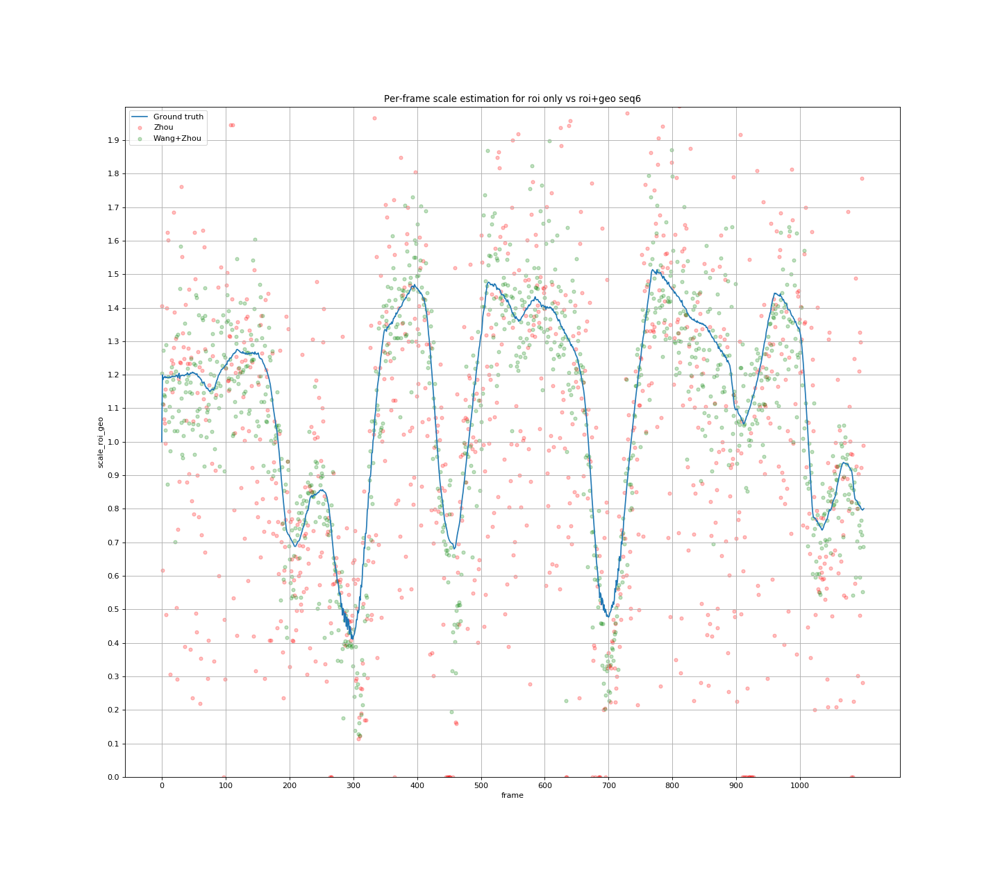
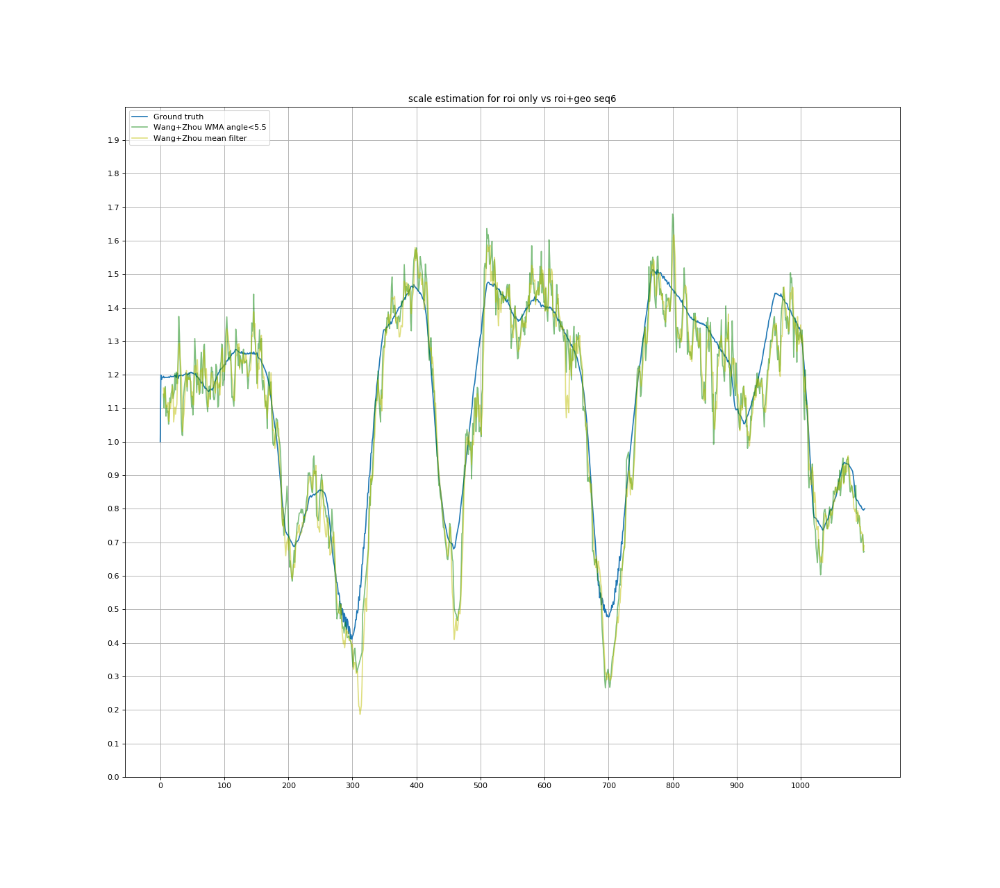
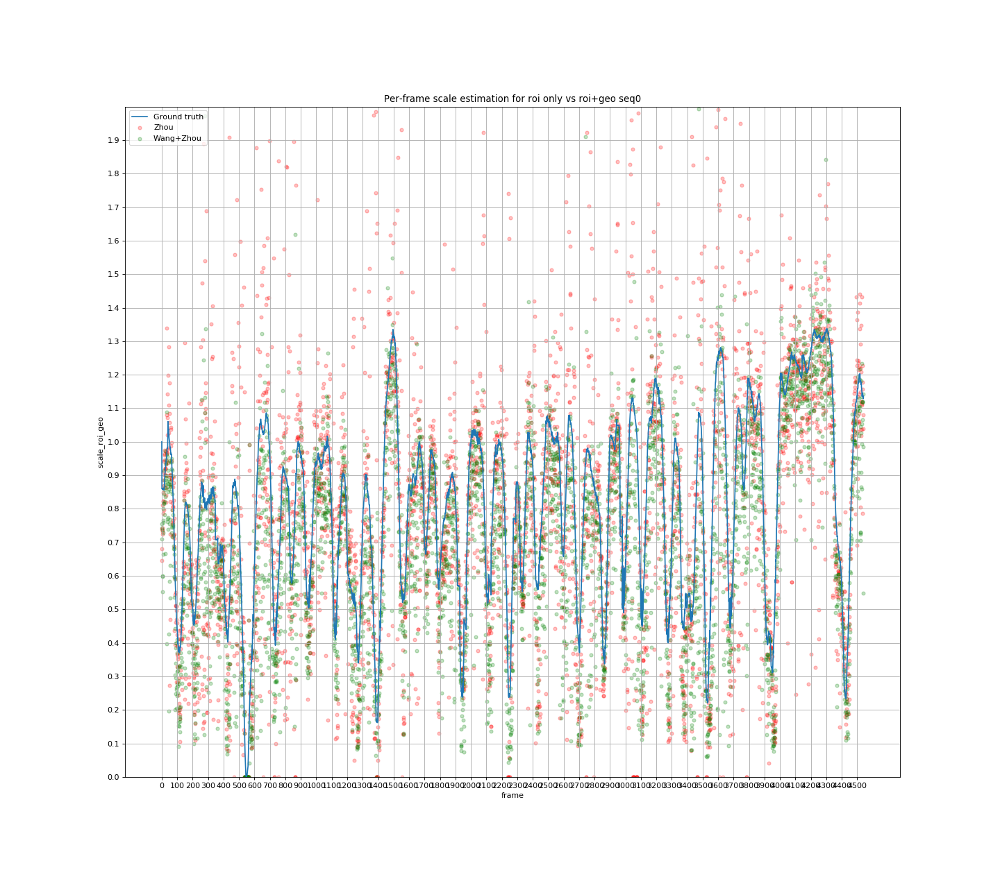
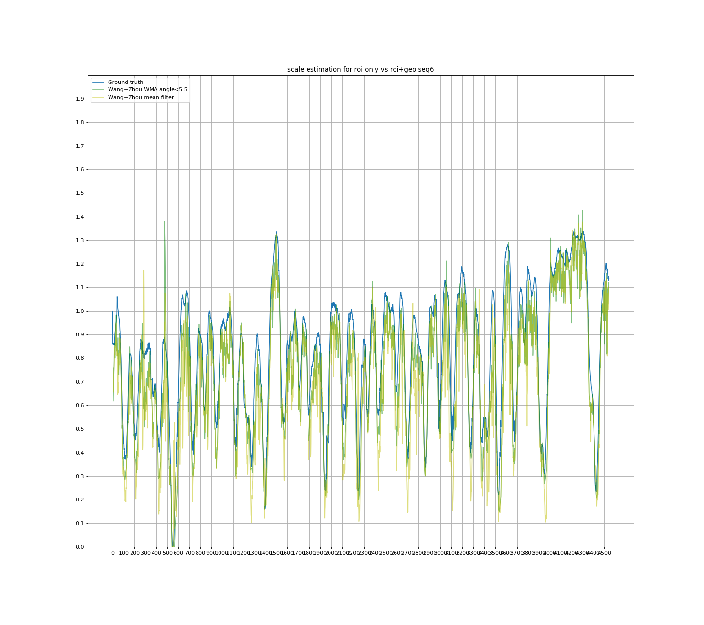
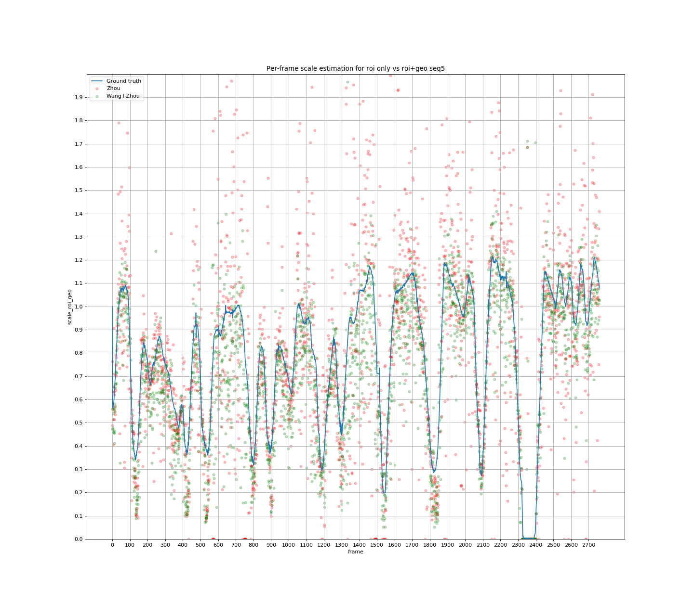
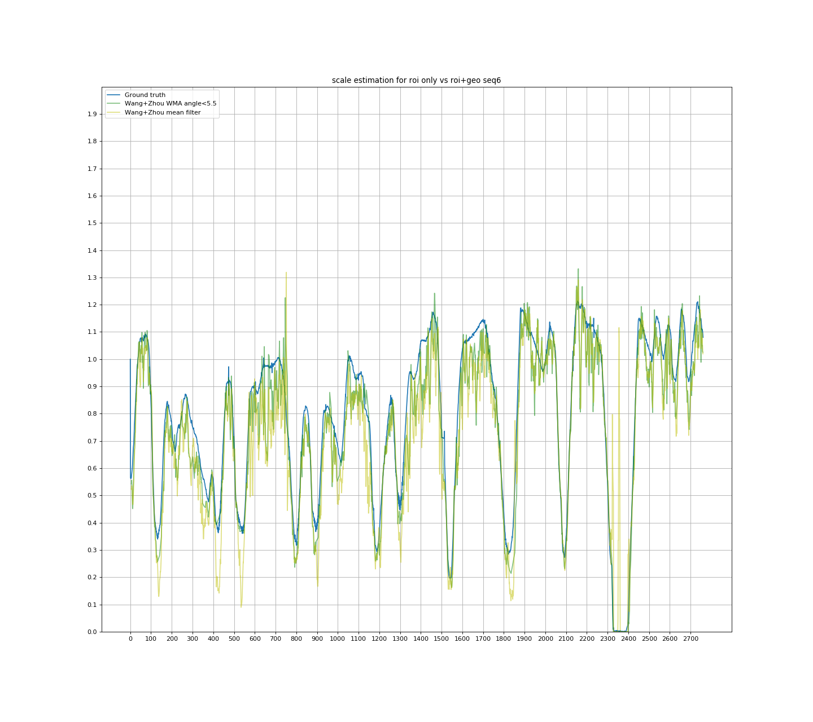
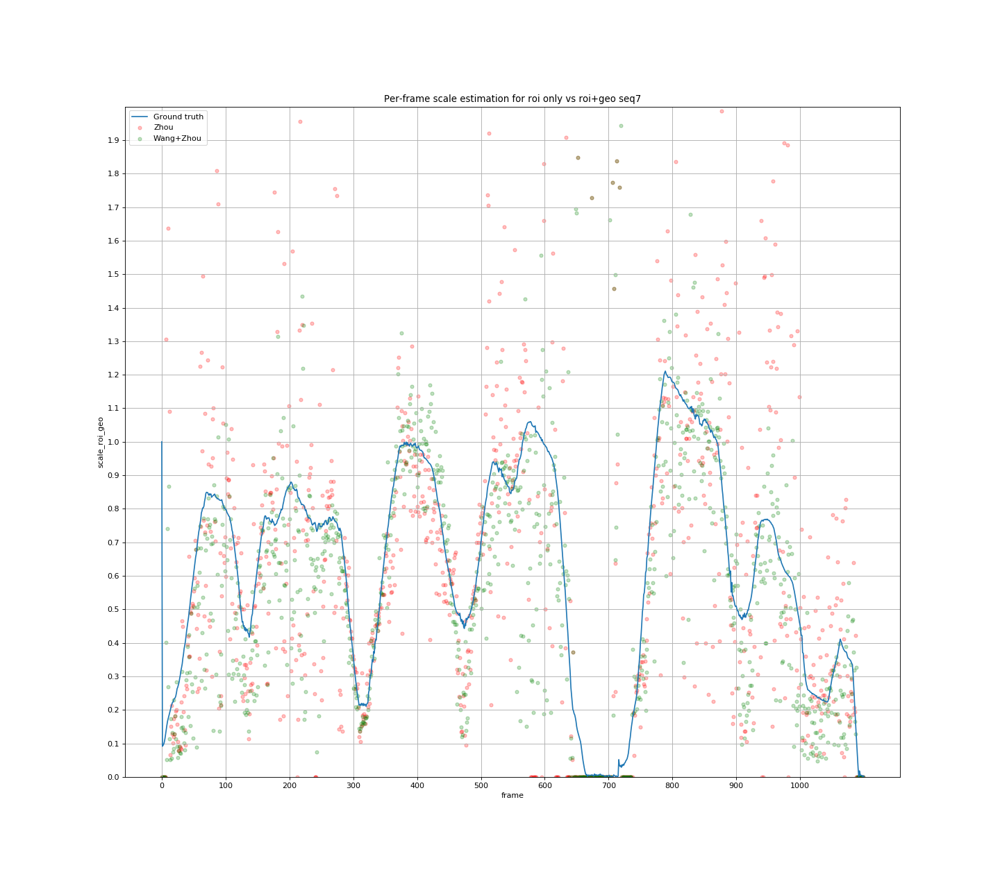
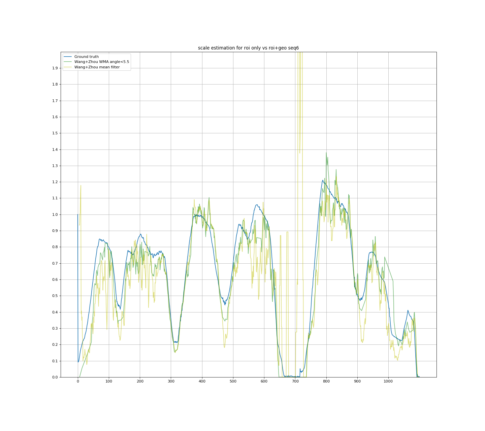

## Monocular VO Scale Estimation

This repository sort of combines and compares the work of Dingfu Zhou's ***Ground Plane based Absolute Scale Estimation for Monocular Visual Odometry*** and Xiangwei Wang's ***Monocular Visual Odometry Scale Recovery using Geometrical Constraint***. Both used the mounted camera height to recover metric scale from monocular VO.

For the former's code, it was in Matlab so I translated into python. He used a predefined ROI to get ground points.

In the latter's repository, some of the libraries used are missing so I replaced with OpenCV. Secondly, I think there are also some errors in the conditions the author made to qualify ground points. I combine the addtional ground points found, with matched points inside the ROI to get more points for homography estimation. 

Each step in the notebook is documented with intermediate results (image) displayed. 

### Results

#### Kitti Seq 06

#### Kitti Seq 00

#### Kitti Seq 05

#### Kitti Seq 07

#### Todo

Inject these scale estimations into ORB SLAM.
